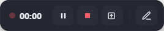
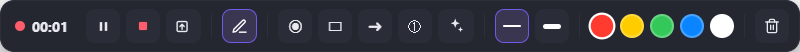

# Joom 🎥

Grabador de **pantalla + cámara para Windows**, pensado para crear contenido:
grabaciones horizontales, **reels verticales** y modo **podcast**, con barra de
**anotaciones** para presentar, **teleprompter**, inserción de **video o
presentaciones** en los reels y **subtítulos automáticos** con IA.

Construido con **Electron**. La pantalla y la cámara se componen en tiempo real en
un `<canvas>` y se graban con `MediaRecorder`; al detener, `ffmpeg` exporta a **MP4**
(H.264 + AAC, listo para redes/web).

## 🛠️ Instalación desde cero (paso a paso)

> Si solo quieres **usar** Joom, haz la **Opción A**. La **Opción B** es para
> ejecutar/compilar desde el código.

### Opción A — Solo usar la app (lo más fácil, sin instalar nada técnico)

1. Descarga el instalador. Tienes dos formas:
   - **Directo del repositorio:**
     **https://github.com/jairocarrizales/joom/raw/main/release/Joom-Setup-0.1.0.exe**
   - O desde la página de **Releases**: https://github.com/jairocarrizales/joom/releases
2. Doble clic en el archivo. Si Windows muestra *"Windows protegió tu PC"*
   (SmartScreen, porque la app no está firmada): clic en **"Más información"** →
   **"Ejecutar de todas formas"**.
3. Sigue el instalador (**no** requiere permisos de administrador). Se crean accesos en
   el **escritorio** y el **menú inicio**.
4. Abre **Joom**. La primera vez Windows pedirá permiso de **cámara** y **micrófono** →
   pulsa **Permitir**.
5. ¡Listo! Elige el modo, la cámara y su forma, y pulsa **Grabar**.

Eso es todo para grabar. Los **extras** de abajo solo hacen falta si vas a usar esas
funciones concretas (subtítulos, YouTube, PowerPoint).

### Opción B — Ejecutar/compilar desde el código (equipo sin nada instalado)

1. **Instala Node.js** (incluye `npm`):
   - Ve a **https://nodejs.org** → descarga la versión **LTS** (instalador `.msi` de
     Windows) → instálala (Siguiente → Siguiente → Finalizar).
   - Abre una terminal **nueva** y verifica: `node -v` y `npm -v`.
2. **Instala Git**:
   - **https://git-scm.com/download/win** → instala con las opciones por defecto.
   - Verifica: `git --version`.
3. **Descarga el código**:
   ```bash
   git clone https://github.com/jairocarrizales/joom.git
   cd joom
   ```
   (Alternativa sin Git: en GitHub, botón verde **Code → Download ZIP**, y descomprime.)
4. **Instala las dependencias** (descarga Electron y ffmpeg automáticamente; tarda unos
   minutos):
   ```bash
   npm install
   ```
5. **Ejecuta la app**:
   ```bash
   npm start
   ```
6. **(Opcional) Crea tu propio instalador `.exe`**:
   ```bash
   npm run dist
   ```
   Queda en la carpeta `dist/` (instalador **NSIS**, Windows x64).

### 🔌 Extras opcionales

| Función | Qué instalar / hacer |
|---|---|
| **Subtítulos con IA** | Crea una **API key gratuita** en **https://console.groq.com** (API Keys) y pégala en la pestaña *Subtítulos* de Joom (se guarda en tu equipo). |
| **Insertar video de YouTube** en reels | Instala **yt-dlp**: descarga `yt-dlp.exe` de https://github.com/yt-dlp/yt-dlp/releases y ponlo en el PATH, **o** con Python: `pip install yt-dlp`. Verifica con `yt-dlp --version`. |
| **Insertar PowerPoint** (`.pptx`) | Ten **PowerPoint** instalado (Joom lo convierte a PDF). **PDF** y **Google Slides** funcionan sin nada extra. |
| **ffmpeg** | **Ya viene incluido** (`ffmpeg-static`). No instalas nada. |

**Requisitos del sistema:** Windows 10 (2004+) o Windows 11. Para compilar/ejecutar
desde código: Node.js 18+ y Git.

## ✨ Funciones

### Modos de grabación
- **Pantalla completa** (horizontal) con la cámara como **burbuja flotante** (movible y redimensionable).
- **Reel vertical** (9:16, salida 1080×1920) con varios diseños:
  - **Solo cámara** (100%).
  - **Video arriba / abajo + cámara**: inserta un video de **YouTube** (lo descarga), un **video de tu PC**, una **presentación PDF/PowerPoint** o **Google Slides**.
  - **Pantalla arriba / abajo + cámara**: tu pantalla en una banda, con **zoom en vivo** para resaltar detalles.
- **Podcast** (pantalla + cámara vertical): pantalla a alto completo y cámara vertical al lado; la cámara se puede **alejar/acercar** y desplazar.

### Cámara y formas
- **Muchas formas de burbuja**: círculo, vertical (móvil), horizontal 16:9,
  **SuperElipse** (squircle), **Pebble** (orgánica), **Círculo difuminado** (niebla),
  **Escudo 1**, **Escudo 2**, **Arco**, **esquinas ancladas** (4 posiciones: la cámara
  se pega a una esquina de la pantalla como cuarto de elipse) o **sin cámara**.
- **Borde configurable** en todas las formas: activar/desactivar, **color** (selector
  navegable saturación/tono + campo hexadecimal + paleta rápida) y **grosor** ajustable.
- **Zoom** de cámara (acercar/alejar) y **espejo** como en Loom.
- La **vista previa es idéntica a lo que se graba** (WYSIWYG): la burbuja flotante se ve
  exactamente como saldrá en el video.

### Barra de presentación (mientras grabas)
- Puntero **láser**, dibujar **rectángulos**, **flechas**, **números** y **confeti** 🎉 (con colores y grosor).
- **Teleprompter** flotante (guion desplazable) que no aparece en el video.

### Video / presentaciones en el reel (controlable mientras grabas)
- **Video** (YouTube o de tu PC): **pausar/reanudar** y **regresar 10 s**, con su audio incluido.
- **Presentaciones** (PDF, PowerPoint o Google Slides): pasar diapositivas con **‹ anterior / siguiente ›** (una a la vez). El PowerPoint se convierte a PDF usando el PowerPoint instalado.
- **Pantalla en banda**: **zoom y desplazamiento** en vivo (rueda/arrastre o botones) para resaltar un detalle.

### Subtítulos automáticos (con IA)
- Transcripción con **Groq** (Whisper `whisper-large-v3`) con **tiempos por palabra**.
- **~32 estilos** (POP/Reel, palabra, caja, manuscrita, DIN colores, disruptivos, clásico…), quemados en el video.
- Opción de **corregir palabras** con un LLM de Groq.
- Solo necesitas tu **API key de Groq** (gratuita) en la pestaña *Subtítulos*; se guarda en tu equipo.

### Otros
- Selector de **calidad** (720p / 1080p / 1080p60 / 1440p), **micrófono** y **audio del sistema**.
- **Modo captura** (`Ctrl+Shift+S`): Joom se oculta de tus grabaciones por defecto; este modo lo hace visible temporalmente para que puedas tomar **capturas de pantalla** de la app.

## 🎬 La barra de grabación

Al grabar aparece una **barra flotante** con los controles (no sale en el video).

**Compacta:**



`⏱` tiempo · **⏸** pausar · **⏹** detener · **⬆️** traer la cámara al frente · **✏️** abrir anotaciones.

**Abierta** (herramientas para presentar):



**⦿** láser · **▭** rectángulo · **→** flecha · **①** números · **✦** confeti · grosor de línea · **colores** · **🗑️** borrar.

En reels con **video / presentación / pantalla** aparecen además sus controles: ◀◀/⏸ del video, **‹ / ›** para pasar diapositivas, o **🔍− / 🔍+** para el zoom de la pantalla.

## ⌨️ Atajos de teclado

| Atajo | Acción |
|---|---|
| `Ctrl+Shift+R` | Grabar / Detener |
| `Ctrl+Shift+P` | Pausar / Reanudar |
| `Ctrl+Shift+A` | Mostrar/ocultar anotaciones |
| `Ctrl+Shift+L` | Activar/desactivar láser |
| `Ctrl+Shift+C` | Confeti 🎉 |
| `Ctrl+Shift+S` | Modo captura (para tomar screenshots de Joom) |

## 🧩 Arquitectura

| Ventana | Archivo | Rol |
|---|---|---|
| Panel de control | `renderer/control.*`, `renderer/subs.js` | Modo, pantalla, cámara, mic, calidad, reel, subtítulos |
| Burbuja flotante | `renderer/overlay.*` | Cámara *always-on-top*, arrastrable; excluida de la captura |
| Compositor (oculto) | `renderer/recorder.*` | Compone pantalla/cámara/video/diapositivas y graba con `MediaRecorder` |
| Barra de grabación | `renderer/recbar.*` | Pausar/detener, anotaciones y controles de video/diapositivas/zoom |
| Capa de anotaciones | `renderer/annotate.*` | Láser, rectángulos, flechas, números y confeti |
| Teleprompter | `renderer/teleprompter.*` | Guion desplazable flotante |
| Selector de zona | `renderer/region.*` | Recuadro de pantalla |
| Subtítulos | `subs-ass.js` | Generador de los estilos `.ass` |
| Proceso principal | `main.js` | Ventanas, IPC, ffmpeg, Groq, yt-dlp, servidor local |

## 💾 Salida

Al **Detener** se abre un diálogo para guardar el `.mp4` (por defecto en *Vídeos*).
Vídeo: H.264, `yuv420p`, `+faststart`. Audio: micrófono (+ sistema y/o audio del video si aplica).
Los subtítulos crean una copia `…-subs.mp4`.

## 📬 Contacto

**Jairo Carrizales** — WhatsApp: **+52 8261582103**

## Licencia

**Licencia de Uso No Comercial (Propietaria/Custom)** — © 2026 Jairo Carrizales.
Todos los derechos reservados.

Uso **personal, educativo y de evaluación** permitido sin costo. Queda **prohibido el
uso comercial, la redistribución, la venta y el sublicenciamiento** sin autorización
previa y por escrito del autor. Para licencias comerciales: **WhatsApp +52 8261582103**.

Consulta el archivo [LICENSE](LICENSE) para los términos completos.
